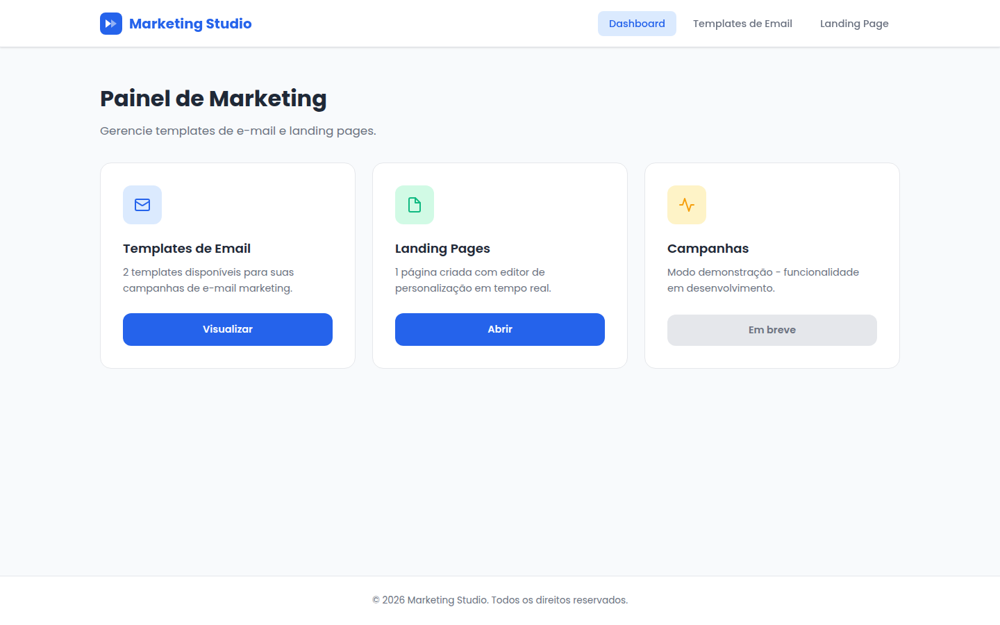
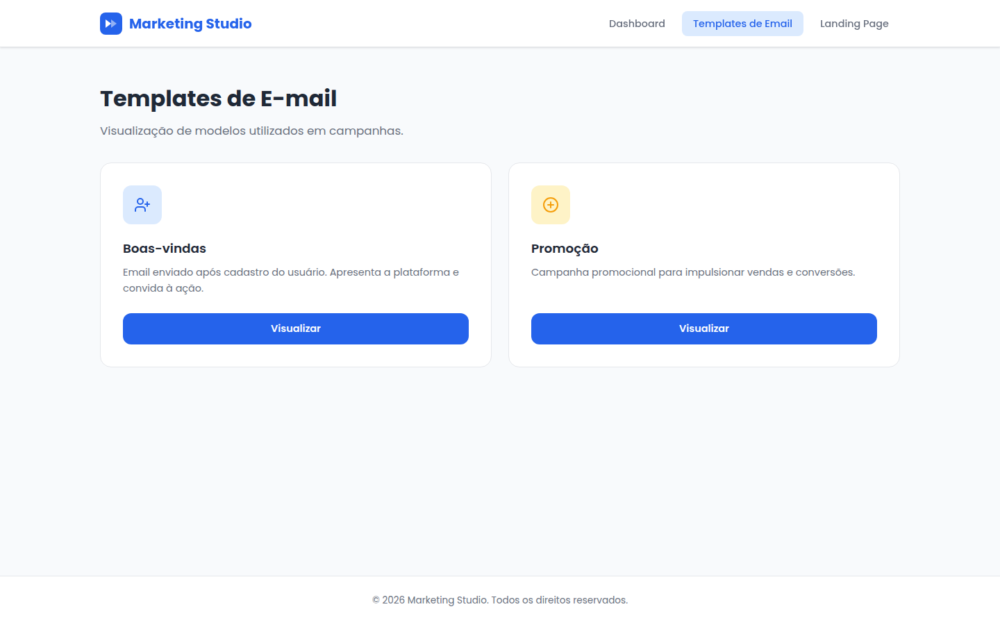
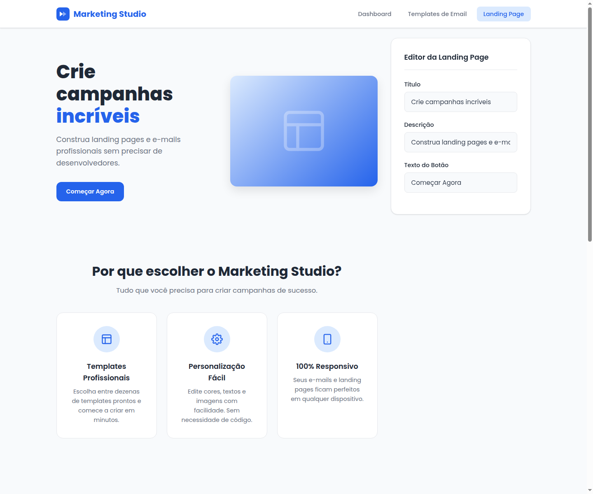

<div align="center">

# 🚀 Marketing Studio


**Uma ferramenta front-end completa para criação e visualização de Landing Pages e Templates de E-mail Marketing.**

---

</div>

## 📖 Sobre o Projeto

O **Marketing Studio** é uma aplicação front-end desenvolvida integralmente com HTML5, CSS3 e JavaScript puro, sem o uso de frameworks ou bibliotecas externas. O projeto simula uma ferramenta de marketing digital profissional, permitindo a criação, visualização e personalização de landing pages e templates de e-mail marketing.

O sistema é composto por três páginas principais: um **Dashboard** administrativo para gerenciar os recursos, uma página de **Templates de E-mail** com dois modelos profissionais renderizados em tabela HTML (conforme o padrão da indústria de e-mail marketing), e uma **Landing Page** completa com editor de personalização em tempo real.

Este projeto foi desenvolvido como portfólio técnico, com o objetivo de demonstrar habilidades sólidas em desenvolvimento front-end, boas práticas de organização de código, design responsivo e manipulação do DOM. A aplicação foi inspirada em plataformas reais de automação de marketing como RD Station, Mailchimp e HubSpot, replicando conceitos de interface e experiência do usuário presentes nesses sistemas.

---

## 🖥️ Demonstração

### Dashboard



### Templates de E-mail



### Landing Page com Editor



---

## 🎯 Objetivo

O Marketing Studio foi projetado para demonstrar competências técnicas essenciais para atuar na criação de Landing Pages e E-mail Marketing. As principais áreas de conhecimento evidenciadas incluem:

- **HTML5 Semântico** — Utilização correta de elementos como `<nav>`, `<main>`, `<section>`, `<aside>`, `<footer>`, `<blockquote>`, `<article>` e hierarquia de headings, garantindo acessibilidade e SEO.

- **CSS3 Moderno** — Uso de Custom Properties (Variáveis CSS), Flexbox, CSS Grid, transições suaves, gradientes lineares, box-shadows em camadas e Media Queries para design responsivo.

- **JavaScript Puro** — Manipulação do DOM com `addEventListener`, `querySelector`, `classList`, `innerHTML`, `textContent`, `scrollIntoView`, e programação orientada a eventos com `input`, `submit` e `click`.

- **Responsividade** — Design adaptável para Desktop, Tablet e Mobile utilizando três breakpoints (`992px`, `768px`, `480px`), com transições entre layout multi-coluna e layout empilhado.

- **E-mail Marketing** — Templates de e-mail construídos com `<table>` layout, seguindo o padrão real de desenvolvimento HTML para e-mails, que exige estrutura tabular para compatibilidade com clientes de e-mail (Gmail, Outlook, etc.).

- **Landing Pages** — Estrutura completa seguindo as melhores práticas: Hero Section, Benefícios, Depoimentos e Formulário de Captura.

- **Organização de Projetos** — Separação clara de responsabilidades entre estrutura (HTML), estilos (CSS) e comportamento (JavaScript), facilitando manutenção e escalabilidade.

---

## ⚙️ Funcionalidades

### 📊 Dashboard

| Funcionalidade | Descrição |
|----------------|-----------|
| Navegação entre páginas | Navbar fixa com links para todas as seções do sistema |
| Cards informativos | Três cards com ícones SVG, descrições e ações |
| Menu responsivo | Hamburger toggle em mobile com animação de abertura/fechamento |
| Estado desabilitado | Botão "Em breve" para funcionalidade em desenvolvimento |

### 📧 Templates de E-mail

| Funcionalidade | Descrição |
|----------------|-----------|
| Toggle de visualização | Botão "Visualizar/Fechar" que mostra e oculta o template |
| Template de Boas-vindas | E-mail de cadastro com header, imagem, CTA e rodapé |
| Template Promocional | E-mail de oferta com banner, badge, features e CTA |
| Table Layout | Estrutura com `<table>`, `<tr>`, `<td>` — padrão real de e-mails |
| Comportamento exclusivo | Ao abrir um template, os outros são fechados automaticamente |
| Scroll suave | Após abrir, a página rola suavemente até o template |

### 📄 Landing Page

| Funcionalidade | Descrição |
|----------------|-----------|
| Hero Section | Layout de 2 colunas com título, descrição, CTA e imagem |
| Benefícios | Grid de 3 cards com ícones SVG inline |
| Depoimentos | 3 depoimentos fictícios com estrelas e avatares |
| Formulário de Captura | Campos nome + email com validação |

### ✏️ Editor em Tempo Real

| Funcionalidade | Descrição |
|----------------|-----------|
| Edição do Título | Input atualiza o `<h1>` do Hero instantaneamente |
| Edição da Descrição | Input atualiza a descrição do Hero em tempo real |
| Edição do Botão | Input atualiza o texto do CTA sem recarregar |
| Destaque Inteligente | A palavra "incríveis" é automaticamente destacada em azul |
| Valores Padrão | Campos voltam ao conteúdo original quando esvaziados |

### 📝 Formulário

| Funcionalidade | Descrição |
|----------------|-----------|
| Validação | Campos obrigatórios verificados no envio |
| E-mail válido | Validação de formato com Expressão Regular |
| Mensagem de Erro | Feedback visual com borda vermelha e mensagem |
| Mensagem de Sucesso | Confirmação verde "Cadastro realizado com sucesso!" |
| Sem reload | `preventDefault()` impede recarregamento da página |
| Animação de clique | Efeito `scale(0.96)` nos botões ao serem pressionados |

---

## 🛠️ Tecnologias Utilizadas

| Tecnologia | Versão | Uso no Projeto |
|------------|--------|----------------|
| **HTML5** | - | Estrutura semântica das 3 páginas |
| **CSS3** | - | Estilos, layouts, animações, responsividade |
| **JavaScript** | ES6+ | Manipulação do DOM, eventos, validação |
| **Google Fonts** | Poppins | Tipografia (pesos 300 a 800) |
| **Flexbox** | - | Layouts unidimensionais (navbar, hero, cards) |
| **CSS Grid** | - | Layouts bidimensionais (grids de cards) |
| **Media Queries** | - | Responsividade (3 breakpoints) |
| **CSS Variables** | - | Sistema de design com 17 tokens |
| **SVG Inline** | - | Ícones sem dependência externa |

---

## 📁 Estrutura do Projeto

```
marketing-studio/
│
├── index.html            # Dashboard principal
├── emails.html           # Página de templates de e-mail
├── landing-page.html     # Landing page com editor
│
├── css/
│   └── style.css         # Estilos compartilhados (792 linhas)
│
├── js/
│   └── app.js            # Funcionalidades JavaScript (155 linhas)
│
├── assets/               # Imagens e recursos estáticos
│
└── README.md             # Documentação do projeto
```

### Descrição dos Arquivos

| Arquivo | Responsabilidade |
|---------|------------------|
| `index.html` | Dashboard com navbar, 3 cards de navegação e footer |
| `emails.html` | 2 cards de templates com visualização toggle e e-mails renderizados em tabela HTML |
| `landing-page.html` | Hero, benefícios, depoimentos, formulário e painel de personalização lateral |
| `css/style.css` | Design system completo: reset, variáveis, componentes, layouts, responsividade |
| `js/app.js` | Navbar mobile, toggle de templates, editor em tempo real, validação de formulário |
| `assets/` | Pasta para imagens, screenshots e recursos visuais |

---

## 🏗️ Arquitetura

O projeto segue o princípio de **separação de responsabilidades**, organizando o código em três camadas distintas:

```
┌─────────────────────────────────────────────┐
│  ESTILOS (css/style.css)                    │
│  Variáveis, reset, componentes, layouts     │
├─────────────────────────────────────────────┤
│  ESTRUTURA (index / emails / landing-page)  │
│  HTML semântico, acessível, organizado      │
├─────────────────────────────────────────────┤
│  COMPORTAMENTO (js/app.js)                  │
│  Eventos, DOM, validação, interações        │
└─────────────────────────────────────────────┘
```

### Por que essa organização?

- **Manutenção facilitada** — Alterar cores não requer modificar HTML ou JS. Mudar comportamentos não afeta o layout.
- **Reutilização** — O arquivo `style.css` e `app.js` são compartilhados entre todas as páginas, evitando duplicação.
- **Escalabilidade** — Adicionar uma nova página requer apenas um novo arquivo HTML que importe os mesmos CSS e JS.
- **Colaboração** — Em equipe, um desenvolvedor pode trabalhar nos estilos enquanto outro trabalha na estrutura HTML.

---

## 📱 Responsividade

A aplicação se adapta fluidamente entre três breakpoints:

### Desktop (acima de 992px)

- Layout multi-coluna para grids de cards
- Hero section com layout de 2 colunas (texto + imagem lado a lado)
- Editor lateral posicionado com `sticky` ao lado do conteúdo
- Navbar horizontal com todos os links visíveis

### Tablet (768px — 992px)

- Hero muda para layout de coluna única (centralizado)
- Editor ocupa largura total abaixo do conteúdo (não é mais sticky)
- Grid de benefícios e depoimentos: 2 colunas
- Tipografia reduzida proporcionalmente

### Mobile (abaixo de 768px)

- Navbar hamburger com menu dropdown vertical
- Todos os grids em coluna única (1 card por linha)
- Cards, formulários e templates com padding reduzido
- Breakpoint extra em 480px para telas muito pequenas

**Técnicas utilizadas:**
- `Flexbox` para layouts unidimensionais (navbar, hero, formulário)
- `CSS Grid` com `auto-fit` e `minmax()` para grids auto-responsivos
- `Media Queries` com `max-width` para adaptação progressiva
- `position: sticky` para o editor lateral no desktop

---

## ✅ Boas Práticas Aplicadas

| Prática | Implementação |
|---------|---------------|
| **HTML Semântico** | Uso de `<nav>`, `<main>`, `<section>`, `<aside>`, `<footer>`, `<blockquote>` |
| **Hierarquia de Headings** | Ordem correta: h1 → h2 → h3 em todas as páginas |
| **Acessibilidade** | `aria-label` no botão hamburger, `<label>` associado a inputs |
| **Variáveis CSS** | 17 tokens de design definidos em `:root` para cores, sombras e border-radius |
| **CSS Organizado** | Seções comentadas, ordem lógica: reset → navbar → componentes → responsivo |
| **Componentização de Estilos** | Classes reutilizáveis: `.btn`, `.card`, `.form-group`, `.section-title` |
| **Código Reutilizável** | Navbar e footer idênticos em todas as páginas, importando o mesmo CSS/JS |
| **Separação de Responsabilidades** | HTML (estrutura), CSS (aparência), JS (comportamento) em arquivos distintos |
| **Nomes Descritivos** | Classes como `.hero-content`, `.benefit-card`, `.editor-panel`, `.email-frame` |
| **Comentários Quando Necessários** | Seções do CSS e funções do JS documentadas |
| **Zero Dependências Externas** | Apenas Google Fonts — sem Bootstrap, jQuery ou frameworks |
| **SVG Inline** | Ícones embutidos no HTML, eliminando requisições HTTP adicionais |
| **Validação de Formulário** | Verificação client-side com feedback visual imediato |

---

## 🏆 O que Este Projeto Demonstra

✔ Organização e arquitetura de projetos Front-End

✔ Desenvolvimento 100% responsivo (Desktop, Tablet, Mobile)

✔ Manipulação avançada do DOM com JavaScript puro

✔ Criação de Landing Pages profissionais

✔ Desenvolvimento de Templates HTML para E-mail Marketing

✔ Uso de `<table>` layout para compatibilidade com clientes de e-mail

✔ HTML semântico e acessível

✔ CSS moderno com Custom Properties, Flexbox e Grid

✔ JavaScript vanilla com eventos, validação e interatividade

✔ Conhecimento de UX/UI aplicado a interfaces SaaS

✔ Sistema de design com variáveis CSS

✔ Design responsivo com Media Queries

---

## 🔮 Melhorias Futuras

| Melhoria | Descrição |
|----------|-----------|
| **Integração com API** | Conectar o formulário a um backend para persistir cadastros |
| **Editor Visual Arrastável** | Permitir arrastar e posicionar elementos na landing page |
| **Persistência com LocalStorage** | Salvar personalizações do editor no navegador do usuário |
| **Exportação de HTML** | Gerar o código HTML dos templates de e-mail para uso externo |
| **Dark Mode** | Implementar alternância de tema claro/escuro |
| **Sistema de Login** | Autenticação de usuários com controle de acesso |
| **Banco de Dados** | Armazenar templates e campanhas em backend (PostgreSQL, MongoDB) |
| **Integração com Mailchimp** | Enviar campanhas diretamente para listas do Mailchimp |
| **Integração com RD Station** | Sincronizar leads e automações com a plataforma |
| **Integração com Salesforce Marketing Cloud** | Conectar com a solução enterprise de marketing |
| **Testes Automatizados** | Adicionar testes unitários e de integração |
| **Deploy Automatizado** | CI/CD com GitHub Actions para publicação |

---

## 🚀 Como Executar

### Opção 1 — Abrir diretamente no navegador

```bash
# 1. Clone o repositório
git clone https://github.com/seu-usuario/marketing-studio.git

# 2. Navegue até a pasta do projeto
cd marketing-studio

# 3. Abra o arquivo index.html no navegador
# No Linux:
xdg-open index.html

# No macOS:
open index.html

# No Windows:
start index.html
```

### Opção 2 — Utilizando Live Server (VS Code)

```bash
# 1. Clone o repositório
git clone https://github.com/seu-usuario/marketing-studio.git

# 2. Abra a pasta no VS Code
code marketing-studio

# 3. Instale a extensão "Live Server" (caso não tenha)

# 4. Clique com o botão direito no index.html
#    e selecione "Open with Live Server"
```

### Opção 3 — Servidor local com Python

```bash
# Navegue até a pasta do projeto
cd marketing-studio

# Inicie o servidor
python3 -m http.server 8000

# Acesse no navegador
# http://localhost:8000
```

---

## 👤 Autora

| | |
|---|---|
| **Nome** | *Marcelly Freitas Neves* |
| **GitHub** | [@marcellyfreitas](github.com/marcellyfreitas) |
| **LinkedIn** | [Marcelly Neves](https://www.linkedin.com/in/marcelly-neves-15a352174) |


---

## 📄 Licença

Este projeto está sob a licença **MIT**. Veja o arquivo [LICENSE](LICENSE) para mais detalhes.

```
MIT License

Copyright (c) 2026 Marketing Studio

Permission is hereby granted, free of charge, to any person obtaining a copy
of this software and associated documentation files (the "Software"), to deal
in the Software without restriction, including without limitation the rights
to use, copy, modify, merge, publish, distribute, sublicense, and/or sell
copies of the Software, and to permit persons to whom the Software is
furnished to do so, subject to the following conditions:

The above copyright notice and this permission notice shall be included in all
copies or substantial portions of the Software.

THE SOFTWARE IS PROVIDED "AS IS", WITHOUT WARRANTY OF ANY KIND, EXPRESS OR
IMPLIED, INCLUDING BUT NOT LIMITED TO THE WARRANTIES OF MERCHANTABILITY,
FITNESS FOR A PARTICULAR PURPOSE AND NONINFRINGEMENT. IN NO EVENT SHALL THE
AUTHORS OR COPYRIGHT HOLDERS BE LIABLE FOR ANY CLAIM, DAMAGES OR OTHER
LIABILITY, WHETHER IN AN ACTION OF CONTRACT, TORT OR OTHERWISE, ARISING FROM,
OUT OF OR IN CONNECTION WITH THE SOFTWARE OR THE USE OR OTHER DEALINGS IN THE
SOFTWARE.
```

---

<div align="center">

Feito com dedicação para demonstração de habilidades em **Desenvolvimento Front-End** voltado para **Marketing Digital**.

</div>
